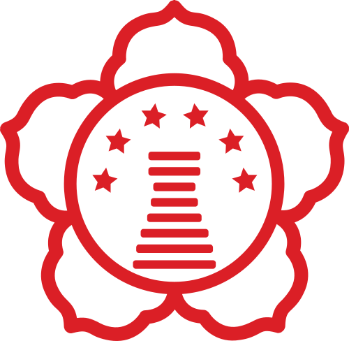

<!-- #  경북대 이어살기 커뮤니티 [KNU - CON]

### 1. [서비스 소개](notion://www.notion.so/928bf1591414452798c30e166d1b8d69#%EC%84%9C%EB%B9%84%EC%8A%A4-%EC%86%8C%EA%B0%9C)

### 2. [서비스 플로우](notion://www.notion.so/928bf1591414452798c30e166d1b8d69#%EC%84%9C%EB%B9%84%EC%8A%A4-%ED%94%8C%EB%A1%9C%EC%9A%B0)

### 3. [데모 영상](notion://www.notion.so/928bf1591414452798c30e166d1b8d69#%EB%8D%B0%EB%AA%A8-%EC%98%81%EC%83%81)

### 4. [기대 효과 & 확장 가능성](notion://www.notion.so/928bf1591414452798c30e166d1b8d69#%EA%B8%B0%EB%8C%80-%ED%9A%A8%EA%B3%BC-&-%ED%99%95%EC%9E%A5-%EA%B0%80%EB%8A%A5%EC%84%B1)

### 5. [Team INFO](notion://www.notion.so/928bf1591414452798c30e166d1b8d69#team-info)

# 서비스 소개

> 경북대 주변의 이어살기 연결을 도와주는 서비스 및 커뮤니티입니다.
> 

## ✨ 서비스 배경

- 내용

## 🎯 서비스 대상

- 내용

## 🚀 서비스 목적

- 내용

# 서비스 플로우

### 1. 회원가입/로그인

### 2. 방 등록 및 방 게시글 올리기

### 3. 게시글 조회,검색 및 사용자 찜 목록 기반 게시글 추천

### 4. 채팅방을 이용한 사용자의 이어살기 연결

### 5. 나의 정보 조회

# 데모 영상

[링크](notion://www.notion.so/%EB%A7%81%ED%81%AC)

# 사용된 스택

**Cooperation** :

**Design** :

**Front-end** :

**Back-end** :

# 기대 효과 & 확장 가능성

- 내용

# Team INFO

### 💡 변지섭 (Jiseob-Byeon) : [alfred.j.byeon@gmail.com](mailto:alfred.j.byeon@gmail.com)

### 💡 이지수 (jisu74) : [lgs010704@gmail.com](mailto:lgs010704@gmail.com)

### 💡 노유수 (noFlowWater) : [noyusu98@gmail.com](mailto:noyusu98@gmail.com) -->
